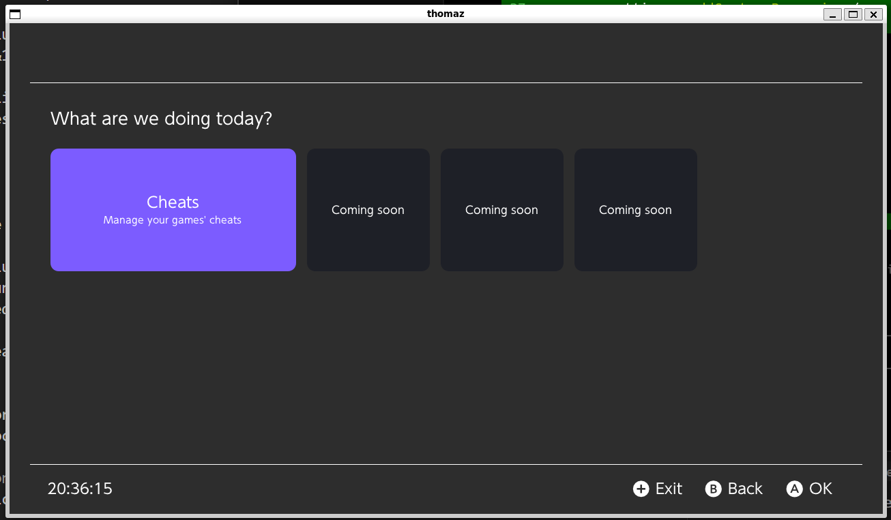
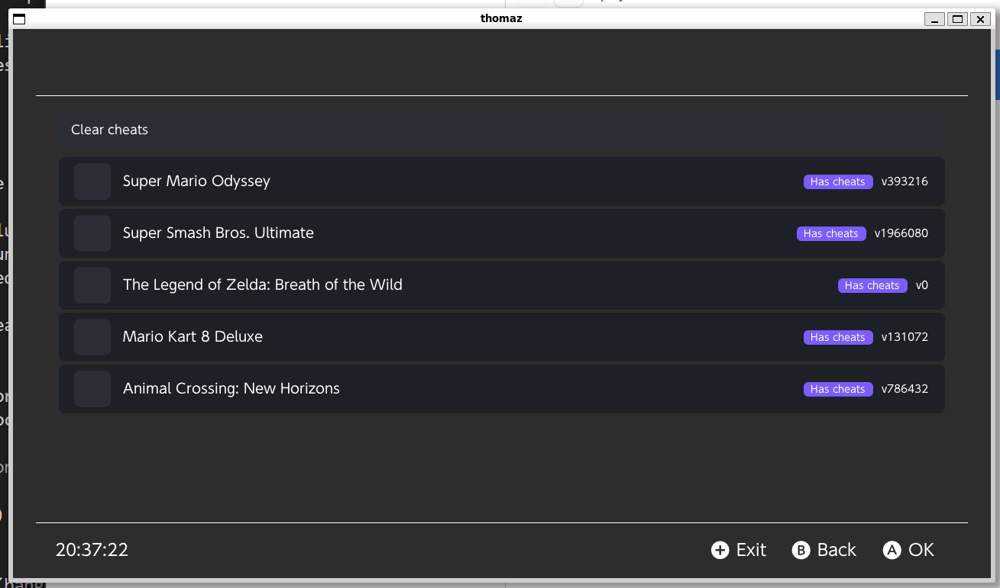

# thomaz

**Gerenciador de trapaças (cheats) para Nintendo Switch** — um homebrew com interface moderna para ativar e desativar cheats dos seus jogos **com o jogo fechado**. O [Atmosphère](https://github.com/Atmosphere-NX/Atmosphere) aplica os cheats no próximo boot do jogo.

Os cheats vêm da base open-source [**switch-cheats-db**](https://github.com/HamletDuFromage/switch-cheats-db). O foco do thomaz é uma **UX bonita, bilíngue (PT-BR / EN) e fácil de usar** — toque, mouse e controle.

> ⚠️ **Status:** em desenvolvimento. O app compila e roda (Switch e desktop), com lógica testada, mas o fluxo completo **ainda não foi validado em hardware real**. Use por sua conta e risco.

---

## ✨ Funcionalidades

- 🎮 **Lista os jogos instalados** com ícone, versão e badges:
  - **Tem cheat** — o jogo está coberto pela switch-cheats-db.
  - **Ativo** — já existe um arquivo de cheats salvo para o jogo.
- 🧩 **Tela de trapaças por jogo** — baixa os cheats certos para a versão instalada, lista cada um como um **toggle**, e salva os ativados na SD (aplicados no próximo boot).
- 🧹 **Limpar trapaças** — selecione um, vários ou todos os jogos e remova seus arquivos de cheat (com confirmação).
- ⚙️ **Configurações**:
  - **Idioma** — Automático (sistema), Português (Brasil) ou English.
  - **Buscar atualizações** — auto-update do app via GitHub Releases.
  - **Atualizar base de cheats** — re-baixa o índice da switch-cheats-db.
- 🌎 **Bilíngue** PT-BR / EN · 👆 **Toque + mouse + controle** · 🎨 tema escuro com acento violeta.

---

## 📸 Capturas de tela

| Início | Meus jogos |
|:------:|:----------:|
|  |  |

<!-- Mais telas em breve: trapaças (toggles), limpar e configurações. -->

---

## 📦 Requisitos

- Nintendo Switch com **Atmosphère** (CFW) e um menu de homebrew (hbmenu).
- Conexão com a internet no console (para baixar cheats e atualizações).
- Espaço no cartão SD.

---

## 🚀 Instalação

1. Baixe o **`thomaz.nro`** na página de [**Releases**](https://github.com/luizfbalves/thomaz/releases/latest).
2. Copie o arquivo para a pasta **`/switch/`** do cartão SD:
   ```
   sd:/switch/thomaz.nro
   ```
3. No Switch, abra o **Álbum** (segurando R para entrar no hbmenu) e inicie o **thomaz**.

> Atualizações futuras podem ser feitas pelo próprio app, em **Configurações → Buscar atualizações** (ele baixa o `.nro` mais recente e substitui o atual; basta reiniciar).

---

## 🕹️ Como usar

1. Abra o **thomaz** com os jogos **fechados**.
2. Toque no card **Trapaças** → escolha um jogo na lista.
3. O app baixa as trapaças disponíveis e mostra os **toggles**. Ative o que quiser — as mudanças **salvam automaticamente** na SD.
4. **Feche o thomaz e abra o jogo.** O Atmosphère aplica os cheats salvos no boot.

Para **remover** cheats: home → Trapaças → **Limpar trapaças** → marque os jogos → **Limpar selecionados**.

### Onde os cheats são gravados
```
sd:/atmosphere/contents/<TITLE_ID>/cheats/<BUILD_ID>.txt
```
Esse é o caminho padrão que o Atmosphère lê. Se um jogo não tem cheats para a versão exata instalada, o thomaz usa os da versão anterior mais próxima (e avisa na tela).

---

## 🛠️ Compilar do código-fonte

O projeto usa **CMake** + o fork mantido do **[Borealis](https://github.com/xfangfang/borealis)** (UI) sobre **libnx/devkitPro**.

### Nintendo Switch (.nro)
A forma recomendada é via **GitHub Actions** (o workflow `build` usa a imagem `devkitpro/devkita64`, que já traz tudo — nenhum `dkp-pacman` necessário). Baixe o artefato `thomaz-nro` da execução. Localmente, com devkitPro instalado:

```bash
git clone --recursive https://github.com/luizfbalves/thomaz.git
cd thomaz
cp -rn lib/borealis/resources/* resources/
cmake -B build_switch -DPLATFORM_SWITCH=ON -DUSE_DEKO3D=ON
make -C build_switch thomaz.nro -j$(nproc)
```

### Desktop (PC) — para iterar na UI sem hardware
```bash
sudo apt install -y cmake build-essential libgl1-mesa-dev xorg-dev libcurl4-openssl-dev
./scripts/build-desktop.sh
./build_desktop/thomaz
```
No desktop os jogos são exemplos fictícios (FakeTitleService), úteis para validar layout e navegação.

### Testes (lógica pura, no host)
```bash
make -C tests test
```

---

## 🧱 Estrutura

```
source/
├── core/       # lógica pura, testável (parse de cheats, resolução de build_id, índice, update)
├── platform/   # libnx/IO (listagem de títulos, HTTP, gravação na SD, settings, self-update)
└── app/        # telas Borealis (home, lista, detalhe, limpar, configurações)
resources/      # i18n (pt-BR/en-US) + XML das telas + ícone
tests/          # suíte host (doctest)
docs/           # spec de design e planos das fases
```

---

## 🗺️ Roadmap

- [x] Núcleo de cheats testado + build .nro verde
- [x] Hub bento, lista de jogos, ícones e badges
- [x] Download e tela de trapaças com toggles
- [x] Limpar trapaças (seleção múltipla)
- [x] Configurações (idioma) + auto-update + atualizar base
- [ ] **Validação em hardware** (listagem real, gravação, aplicação pelo Atmosphère)
- [ ] Carregamento lazy de ícones para bibliotecas grandes
- [ ] Verificação TLS com cacert.pem embarcado

---

## 🙏 Créditos

- [switch-cheats-db](https://github.com/HamletDuFromage/switch-cheats-db) — base de cheats.
- [Borealis (xfangfang)](https://github.com/xfangfang/borealis) — biblioteca de UI.
- [devkitPro](https://devkitpro.org/) / [libnx](https://github.com/switchbrew/libnx) — toolchain.
- [Atmosphère](https://github.com/Atmosphere-NX/Atmosphere) — CFW que aplica os cheats.

Inspirado por ferramentas como EdiZon-SE, Breeze e AIO-switch-updater — com o objetivo de uma interface mais moderna e amigável.

---

## ⚖️ Aviso

thomaz é uma ferramenta para uso pessoal em jogos que você possui. Cheats podem causar comportamento inesperado; **nunca use trapaças em jogos online**, sob risco de banimento. Use por sua conta e risco.

---

## 📄 Licença

Distribuído sob a licença **MIT** — veja [`LICENSE`](LICENSE).
